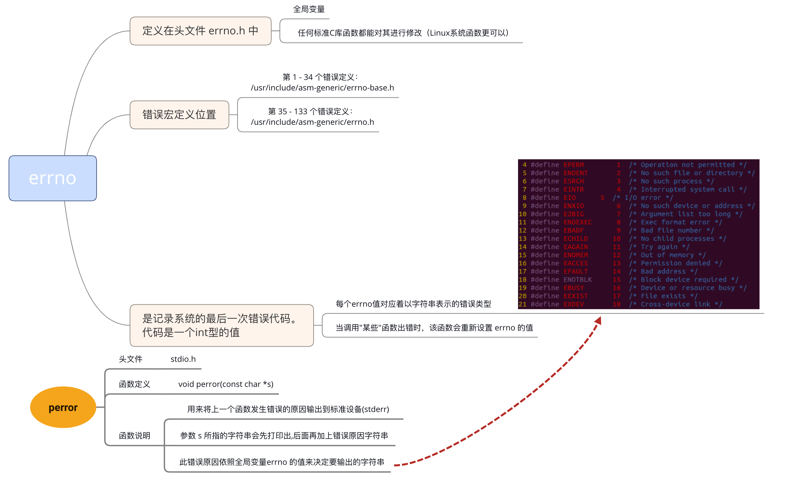

# 一.Linux系统编程

## (一).文件IO操作

### 1.C库函数


> 标准C库中提供了对应的IO缓冲区，缓冲区的速度比硬盘更快，操作文件效率更高
>
> Linux 系统函数没有IO缓存区，需要自己提供

+ **C库函数与系统函数的关系：**


### 2.虚拟机地址空间


> 32位分配4G(2^32)
>
> + 栈空间从上往下分配，堆空间从下往上分配
> + C标准库和Linux系统IO函数为动态库，生成与位置无关的代码，地址为相对地址

+ **文件描述符：**


**cpu 为什么要使用虚拟地址空间与物理地址空间映射？解决了什么样的问题？**

+ 方便编译器和操作系统安排程序的地址分布。
  + 程序可以使用一系列相邻的虚拟地址来访问物理内存中不相邻的大内存缓冲区。
+ 方便进程之间隔离
  + 不同进程使用的虚拟地址彼此隔离。一个进程中的代码无法更改正在由另一进程使用的物理内存。
+ 3.方便OS使用你那可怜的内存。
  + 程序可以使用一系列虚拟地址来访问大于可用物理内存的内存缓冲区。当物理内存的供应量变小时，		
  + 内存管理器会将物理内存页（通常大小为 4 KB）保存到磁盘文件。数据或代码页会根据需要在物理内存与磁盘之间移动。

### 3.open函数

#### open函数基础

+ **查找系统open函数：**

  ```bash
  man 2 open
  ```


#### close函数


#### open函数中的errno



#### 查阅文档

+ 写函数是跳到对应的文档

  ```bash
  # 精确的跳到对应的文档：把光标放到函数身上，按以下快捷键
  2 + shift + k
  ```

### 4.read与write函数


---

### 1.Linux 快捷键

<div align="center">
    
</div>

